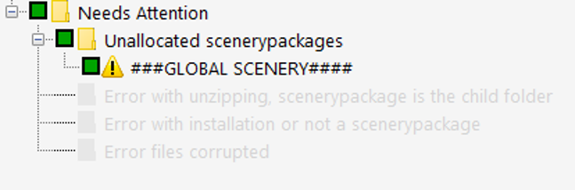
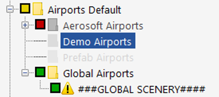
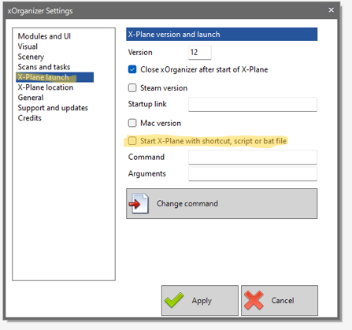
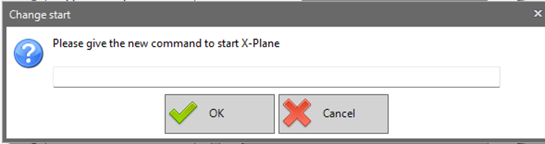

# Installation Guide

1. Drag the `xorg2-xp12.exe` into the X-Plane Custom Sczenery Folder
2. Launch the `xorg2-xp12.exe`
    This will create the needed dummy folder. (Ignore the errors)
3. Customize XOrganizer-V2 Profile
    1. A dummy folder called `###GLOBAL SCENERY####` will appear in the Needs Attention Section. 

    

    2. Move `###GLOBAL SCENERY####` into the `Airport Defaults/Global Airports` Folder

    

4. Customize xOrganizer V2 Settings
    1. Open Settings and select `Start X-Plane with shortcut, script or bat file`

    
    2. Enter the path of the `xorg2-xp12.exe` as the Start Command and Confirm.
    In my case it was `D:/X-Plane12/Custom Scenery/xorg2-xp12.exe`

    

5. Open X-Plane from X-Organizer V2 for the changes of V2 to work.